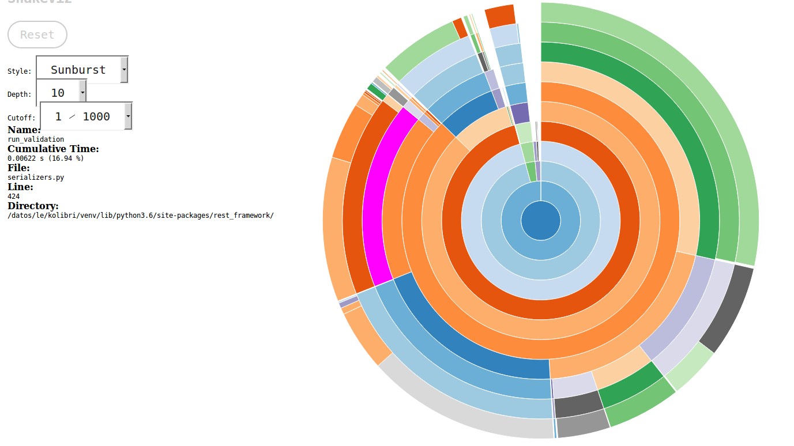
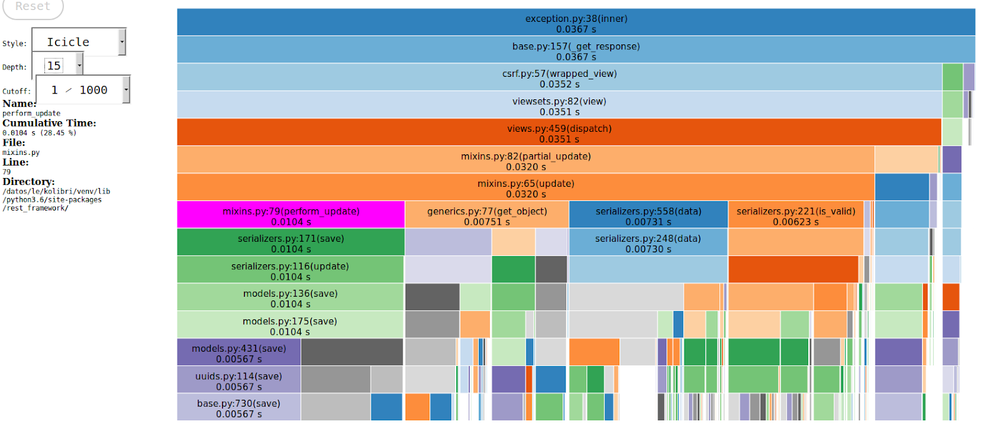
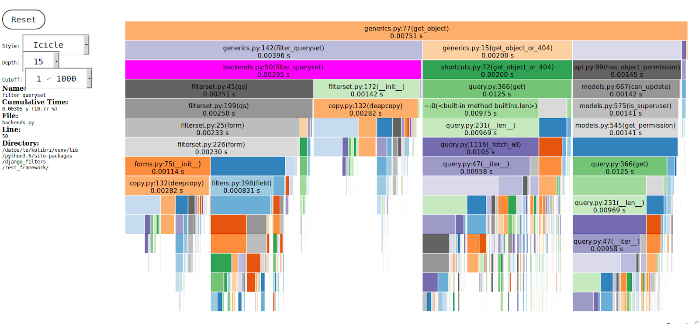
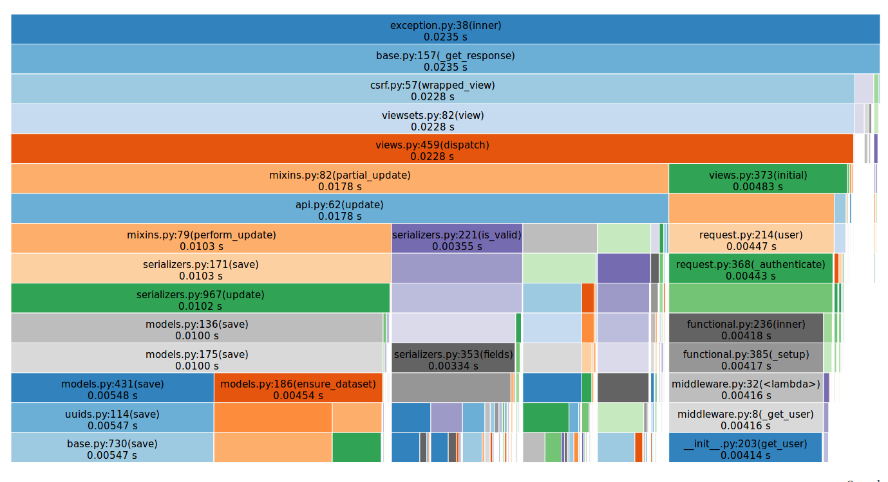

# Kolibri profiling

[Velox](../README.md) ⟶ Advanced Usage ⟶  Kolibri profiling

## Overview

When you need to do a more fine-grained investigation of the parts of the code that might be causing performance issues, profiling is one of the most useful tasks. However, profiling a web application is quite hard as many consecutive requests happen and the application has many layers. 

In our case, those layers include Django, DRF or the CherryPy web server when running Kolibri in production mode. 

After some investigation, two libraries seem to be suitable for profiling the execution of the code in the endpoints requested by the frontend:

- Pyinstrument, https://github.com/joerick/pyinstrumentCustomizable 
- Django Profiler, https://github.com/someshchaturvedi/customizable-django-profiler 

In this document, we explain how to use each of them, but we'll focus in Django Profiler because its feaures make it more suitable to test API requests.


## Customizable Django Profiler

https://github.com/someshchaturvedi/customizable-django-profiler

#### Setup

```bash
pip install customizable-django-profiler
```

In *kolibri/kolibri/deployment/default/settings/base.py*:

1. Add *customizable_django_profiler.cProfileMiddleware* to the end of MIDDLEWARE:

```python
MIDDLEWARE = [
   'kolibri.core.device.middleware.IgnoreGUIMiddleware',
   'django.middleware.gzip.GZipMiddleware',
....
   'django.middleware.clickjacking.XFrameOptionsMiddleware',
   'django.middleware.security.SecurityMiddleware',
   'customizable_django_profiler.cProfileMiddleware'
]

## 
```

2.  Add anywhere in that same *base.py* file:

 ```python
PROFILER = {
   'activate': True,
   'output': ['dump', 'console'],
   'count': '10',
   'file_location': '/tmp/profile',
   'trigger': 'query_param:contentsummarylog'
}
 ```
Where:

- `output` is a list of the desired outputs: '*dump*' is a Python binary cprofile output that can be used with some visualization tools ( for example snakeviz, https://jiffyclub.github.io/snakeviz/ ) . Other  possible outputs are ‘*console*’, ‘*file*’ and ‘*response*’ , they are documented at https://github.com/someshchaturvedi/customizable-django-profiler together with more options.
- `count` is the number of calls to be shown in the console output
- `file_location` is a directory to place the profiling files (one per request)
- `trigger` is a substring that can be used to trigger the profiler only when the requested url contains part of the string. In the above example, all requests containing '*contentsummarylog*' in the url will trigger the profiler.


#### Pros

​	When used together with *snakeviz*, it is a really useful tool to analyze where time is spent in every request.

#### Cons

​	The profiler had a couple of bugs, including a memory leak, and it didn’t allow filtering PATCH requests nor creating binary profiling dumps. However, they quickly accepted [two](https://github.com/someshchaturvedi/customizable-django-profiler/pull/3) [PR](https://github.com/someshchaturvedi/customizable-django-profiler/pull/4) to solve these problems and the latest version has all the features we need. 

### Snakeviz integration

​	[https://jiffyclub.github.io/snakeviz/](https://jiffyclub.github.io/snakeviz/)
	Output console is nice and can be helpful for simple cases, or just to have a measurement of the time spent in the backend for the request. 
	To do it:

1. When setting the profiler in the base.py file, ensure ‘dump’ is in the list of the enabled outputs, and ‘file_location’ is set too.
2. Install snakeviz: `pip install snakeviz`
3. In the file_location directory you can do
	`snakeviz any_of_the_generated_files.prof`

A small server is started and the browser will show the generated page. 
Example:
```bash 
(venv) jose@casa-pro:/datos/le$ snakeviz validation_replaced.prof
snakeviz web server started on 127.0.0.1:8080; enter Ctrl-C to exit 
http://127.0.0.1:8080/snakeviz/%2Fdatos%2Fle%2Fvalidation_replaced.prof
```

The page has two options for the view: *Sunburst* & *Icicle*

Sunburst is well explained at https://jiffyclub.github.io/snakeviz/#interpreting-results




*Icicle* is the one that has seemed most useful to debug/profile Kolibri as the waterfall view made it easy to find how the time was distributed.



Clicking on any of the calls will make the server generate a new chart, zooming into the selected call.




To go back to the main view, the top left reset button can be used.


#### Profiling results example

Original code execution times:


After we profiled and performed optimizations:




## PyInstrument

Sources at https://github.com/joerick/pyinstrument 

#### Setup

Instructions are provided at https://github.com/joerick/pyinstrument 

#### Pros

1. The output is a really nice html page that, when viewed in a browser, contains some javascript that allows navigating easily through the requests, looking at all the measurements.
2. It’s damn fast, it has a C extension that filters out requests < 1ms to get a fast response without altering too much the normal behaviour of the analyzed code.

#### Cons

It does not have an option to select the endpoint that is going to be profiled, so when many different endpoints are called from the backend, it produces a lot of profiling info that’s mostly noise. 


## Table of Contents

- [Velox](../README.md)
  - [Installation](./installation.md)
  - [Configuration options](./configuration-options.md)
  - Using Velox
    - [Internally](./using-velox-internally.md)
    - [Testing an external Kolibri server](./using-velox-externally.md)
  - Advanced usage
    - [Virtual machines](./advanced-usage-vms.md)
    - **Kolibri profiling**
